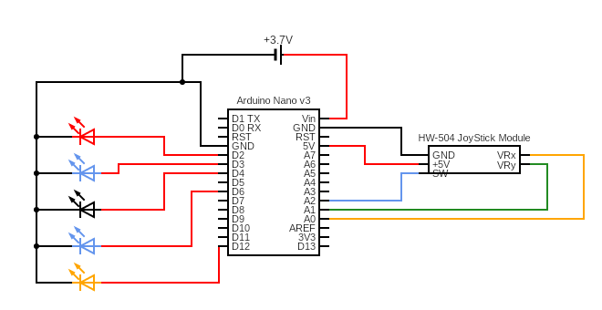

# Experiment using Joystick module (hardware) and LEDs with Arduino Nano

## Abstract
This small experiment's purpose is to learn how to use an Arduino to take analog input from a joystick and trigger some kind of response with respect to the signals received. 
In this experiment, the triggered responses are simulated using LEDs by turning them on and off in response to the movement of the joystick and button press 
Later on, this knowledge and experience can be applied in the making of a wired/wireless controller for another machine.

## Hardware
1. Arduino Nano
2. HW-504 joystick module
3. LEDs
4. Jumperwires
5. Breadboard 
(Optional)
6. 18650 Li-ion battery 3.7V
7. 18650 battery holder 1s

## Circuit Diagram

